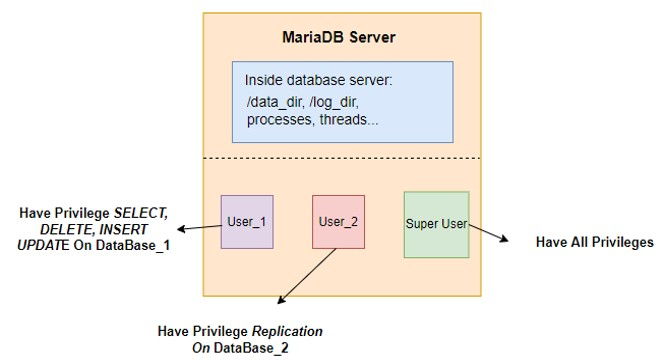
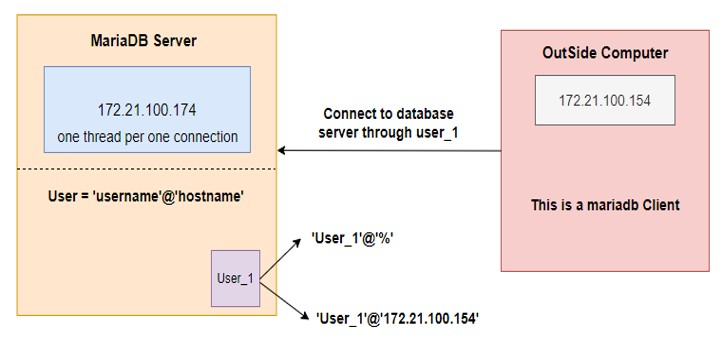
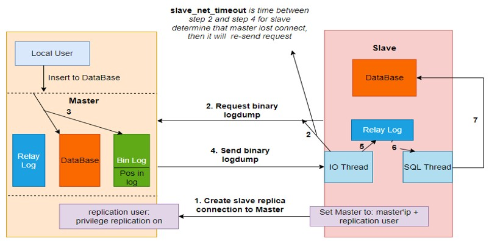

# **Document For Maria Database**

## **Installation**
```
```
## **Inside Maria Database Management System**


*figure 1: inside database management system*

### **Inside a maria database server, we have:**
- Data directory, log directory, its own process, threads to process requests or inner tasks...
- Users (included username and host) for clients connect to server through it



*figure 2: client connect to a server*

## **How Replicat Work In MariaDB**
### **In Maria Database, we have 3 types of log**
- Normal log: files contain logging error or some information about tasks that database server has processed
- Bin log: files contain all information about sql query made in the server, included metadata like error codes. Used for master side in replicat
- Relay log: files contain information sent by bin log to serve replication. Used for slave side in replicat

### **Work Flow Of Replication**
1. First, we need to create a user have replication privilege on some databases or just some tables in a spectific database for slave connect to master. We need some config in this step to slave server complete connect as a slave to its master server. We will show in config section.
2. After complete their connections. IO thread in slave server will send request to its master. These requests will include information about latest position of bin log file in master server. **_Lost Connection:_** After *slave_net_timeout* if slave haven't received response from master, it will consider lost connection and resend the request. If we want send some heartbeat messages to possible reconnect before resend request, we can config *MASTER_HEARTBEAT_PERIOD* less than the *slave_net_timeout* value. The heartbeat interval defaults to half the value of *slave_net_timeout*.
3. Master server send binary logdump to its slave server.
4. IO thread in slave server puts binary logdump into relay log.
5. SQL thread in slave server reads new informations from relay log files and executes queries to synchronize.



*figure 3: work flow of replication in mariadb*

## **Configuration**
### **Config MariaDB Replication**
- Create replication in master server
```
$mysql console
create user 'slavename'@'slavehost' identified by 'password';
grant replication slave on database.* to 'slavename'@'slavehost';
flush privileges;
# Get gtid_current_pos in bin log of master server to set it for slave later. Example "0-1-2149"
select @@GLOBAL.gtid_current_pos;
```

- Connect slave server to master server through created replication user
```
$mysql console
stop slave;
reset slave;
set global gtid_slave_pos = "0-1-2149";
change master to master_host='slavehost',master_user='slavename',master_password='password',master_use_gtid=slave_pos;
start slave;
show slave status\G;
```

### **Remarkable Configuration**
- *slave_net_timeout:* if time that slave wait to reponse from master exceed this value, slave will re-send request to master. 
  - ```$mysql console```
  - ```set global slave_net_timeout="seconds time";```
- *master_heartbeat_period:* period of time slave send heartbeat message. This value must be less than *slave_net_timeout*, usually to half the value of *slave_net_timeout*. 
  - ```$mysql console```
  - ```stop slave;```
  - ```change master to master_heartbeat_period="seconds time";``` 
  - ```start slave;```
- *wait_timeout* and *interactive_timeout*. set 2 variables as the same value to indicate time database server decide a connection is expired and remove it.
  - ```[mysqld]```
  - ```wait_timeout = "seconds time"```
  - ```interactive_timeout = "seconds time"```

- *server-id:* need to set in a replication cluster. Each server must has an unique server-id value.
- *log_bin:* to enalbe bin log and specify path to save bin log files.
- *binlog_format:* usually using row format.
- *gtid_strict_mode:* new event attached to each event group in the binlog. It make easier to catch the last state position if slave crashes. High recommend to enable it.
  - ```[mysqld]```
  - ```gtid_strict_mode=1``` 
- *auto_increment_increment* and *auto_increment_offset*. Use for master-master replication cluster and for tables that have AUTO_INCREMENT columns. *auto_increment_increment* is greater than or equal to number of server in the cluster to avoid data-race when multi masters concurrently insert records into its database. *auto_increment_offset* is a start value, that a server start increase from it. Example, we can have config these variables with a master-master replication cluster comprise 2 server.
  - ```[mysql]```
  - ```auto_increment_increment=2```
  - ```auto_increment_offset=1```

### **There Are Some Configs In my.cnf File Will Be Like That**
```
[mysqld]
server-id=1
bind-address = 172.21.100.174
log_bin=/var/log/mysql/mariadb-bin
slave_compressed_protocol = 1
binlog_format = row
gtid_strict_mode=1
auto_increment_increment=2
auto_increment_offset=1
log_slow_verbosity = query_plan,explain
performance_schema=on
wait_timeout = 172800
interactive_timeout = 172800
max_allowed_packet = 524288000
slave_net_timeout = 3000
```
### **Some Useful Command To See Variables**
- ```show slave status\G;```
- ```show status like '%heartbeat%';```
- ```Show variables like '%slave_net_timeout%';```

### **References**
- More variables in mariadb or mysql database found in this site [replication-options](https://dev.mysql.com/doc/refman/8.0/en/replication-options-replica.html) and [replication-auto-increase](https://dev.mysql.com/doc/refman/5.7/en/replication-options-source.html).
- Global Transaction ID (gtid) in MariaDB [global-transaction-id](https://mariadb.com/kb/en/gtid/).
- Book MariaDB High Performance by Pierre MAVRO [amazon-link](https://www.amazon.com/MariaDB-High-Performance-Pierre-MAVRO/dp/1783981601).
- MariaDB documents [mariadb-document](https://mariadb.com/kb/en/documentation/).

### **Securing connections for client and server in mariadb**
- Document reference [securing-connections](https://mariadb.com/kb/en/securing-connections-for-client-and-server/#requiring-tls)


*figure 4: securing using Transport Layer Security(TLS) in mariadb*

## **More About Relational Database**
### **Keys And Indexes**
- Primary key: it is a index, has unique value and never be null. It will always identify only one record, and each record must be represented. Each table can only have one primary key. Primary key can contains more than one column call composite primary key. 
  - ```ALTER TABLE "table name" ADD PRIMARY KEY(column(s));```
- Unique index: it is unique value, but can be null. Each key value identifies only one record, but not each record needs to be represented.
  - ```ALTER TABLE "table name" ADD UNIQUE `index name`(`column name`); ```
- Plain index: it does not need to be unique, such as foreign key.
  - ```ALTER TABLE "table name" ADD INDEX `index name`(`column name`);```
- Full-Text Index: support full-text indexing and searching.
  - ```ALTER TABLE "table name" ADD FULLTEXT(column_name1, column_name2,…)```
- Document reference [getting-start-with-indexes](https://mariadb.com/kb/en/getting-started-with-indexes/).
- Index Prefixes: With col_name(N) syntax in an index specification for a string column, you can create an index that uses only the first N characters of the column. Indexing only a prefix of column values in this way can make the index file much smaller.
  - ```ALTER TABLE "table name" ADD INDEX `index name`(column name(N));```
  - Document reference [column-indexes](https://dev.mysql.com/doc/refman/8.0/en/column-indexes.html).

### **Foreign Keys Constraints**
- NO ACTION: When the ON UPDATE or ON DELETE clauses are set to NO ACTION, the performed update or delete operation in the parent table will fail with an error.
- CASCADE: Delete or update the row from the parent table and automatically delete or update the matching rows in the child table.
- SET NULL: If the referenced values in the parent table are deleted or modified, all related values in the child table are set to NULL value.
- SET DEFAULT: If the referenced values in the parent table are updated or deleted, the related values in the child table with FOREIGN KEY columns will be set to its default value.
- Document reference [create-table-foreign-key](https://dev.mysql.com/doc/refman/5.6/en/create-table-foreign-keys.html), [common-used-foreign-key](https://www.sqlshack.com/commonly-used-sql-server-constraints-foreign-key-check-default/), [no-action-constrain](https://stackoverflow.com/questions/12096790/why-to-use-foreign-keys-with-no-action-on-delete-or-update).


