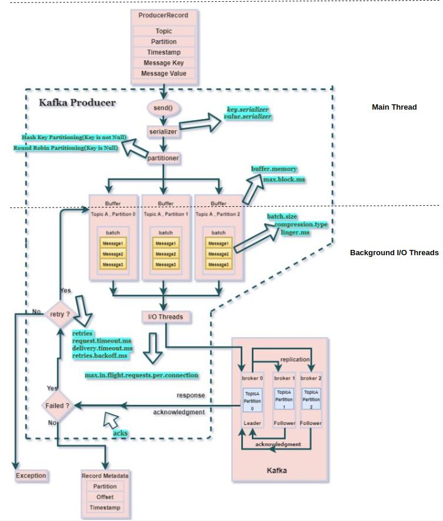
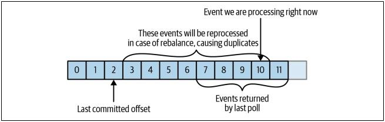
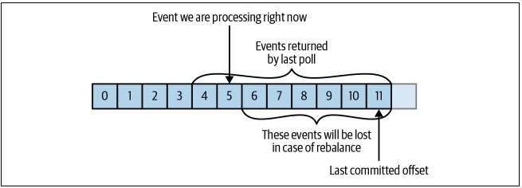

# **Document For Kafka**

## **Installation And Run Kafka Server**
```
docker-compose -p cluster1 up -d
```
## **Producer Workflow**
[Kafka Producer Architecture](https://www.clairvoyant.ai/blog/unleash-kafka-producers-architecture-and-internal-workings).



## **Configuration**
### **Broker Config**
- To config topic in client side, disable *auto create topic in kafka broker server*, set auto.create.topics.enable = false. If not, all topic created in client side will has default config of broker server. In environments of kafka services in docker-compose file. Add *KAFKA_AUTO_CREATE_TOPICS_ENABLE: 'false'* to disable it.
- *KAFKA_MESSAGE_MAX_BYTES:* Default (1MB). Maximum request message size broker reveive from producer. Shoud set larger if send larger 1MB data. It can set in topic level.
- *KAFKA_REPLICA_FETCH_MAX_BYTES:* Default (1MB) The number of bytes of messages to attempt to fetch for each partition. If config for clusters with message size is larger than 1MB, config it with larger number.
- *KAFKA_MIN_INSYNC_REPLICAS:* Default(1). Specifies the minimum number of replicas that must acknowledge a write for the write to be considered successful. Default 1, mean that only a partition leader send acknowledge. It's important for clusters config.
- *OFFSETS_RETENTION_MINUTES:* Default(7 days). After a consumer group loses all its consumers (i.e. becomes empty) its offsets will be kept for this retention period before getting discarded.

### **Some Remarkable Topic Configuration For Experiment And Production**
- *segment.bytes:* Default (1GB). Segment file size for the log. Retention rule applies for segment file, not for message. When lastest message in a segment is eligible for deletion based on the retention rules, the whole segment file is deleted, [reference](https://dalelane.co.uk/blog/?p=3993).
- *retention.ms:* Default (7 days). Maximum time we will retain a log before we will discard old log segments to free up space if we are using the "delete" retention policy
- *delete.retention.ms:* Default (delete). Define retention rules.
- *max.message.bytes:* Default (1MB). Maximum request message size broker reveive from producer for this topic. If producer want to send a larger 1MB message to this topic, config it larger size of sent message. 
- [Kafka Apache Document](https://kafka.apache.org/documentation.html#topicconfigs).
- [Kafka Python Configuration](https://github.com/edenhill/librdkafka/blob/master/CONFIGURATION.md).

### **Some Remarkable Producer Configuration For Experiment And Production**
- **_message.max.bytes:_** Default (1MB). Maximum request message size producer can send to broker topic. If producer want to send a larger 1MB message to this topic, config it larger size of sent message.
- **_batch.num.messages:_** Default (10000). Maximum number of messages batched in one MessageSet before producer send request to broker. The total MessageSet size is also limited by *batch.size* and *message.max.bytes* value. 
- *batch.size:* Default(1MB). Maximum size (in bytes) of all messages batched in one MessageSet, including protocol framing overhead. This limit is applied after the first message has been added to the batch, regardless of the first message's size, this is to ensure that messages that exceed batch.size are produced. The total MessageSet size is also limited by *batch.num.messages* and *message.max.bytes* value.
- **_queue.buffering.max.messages:_** Default(100000), **_queue.buffering.max.kbytes_** Default (1GB). max number messages or max size in KB of producer queue. This queue shared for all topic and partition. *queue.buffering.max.kbytes* has higher priority
- *linger.ms:* Alias for **_queue.buffering.max.ms_** Default (5ms). Delay in milliseconds to wait for messages in the producer queue to accumulate before constructing message batches (MessageSets) to transmit to brokers. A higher value allows larger and more effective (less overhead, improved compression) batches of messages to accumulate at the expense of increased message delivery latency. Exceed deplay time, producer will transmit MessageSets to brokers.
- **_acks:_** Alias for **_request.required.acks_:** Default(-1). Important for clusters config. This field indicates the number of acknowledgements the leader broker must receive from ISR brokers before responding to the request. If acks=0, producer won't wait for an acknowledgement. If acks=1, acknowledgement is sent by the broker when message is successfully written on the leader. If acks=-1(all), acknowledgement is sent by the broker when message is successfully written on all replicas. This config depend on **_min.insync.replicas_** of broker server and must be larger or equal it. If there are less than min.insync.replicas (broker configuration) in the ISR set the produce request will fail. Further, Should configure "retries" property in async-producer so that, if an acknowledgement fails (due to any reason e.g. packet corrupted/lost), the producer knows how many times it should try again to send the message (increase the guarantee of delivery). [See post](https://stackoverflow.com/questions/56258031/what-is-the-impact-of-acknowledgement-modes-in-asynchronous-send-in-kafka).

- **_delivery.timeout.ms:_** Alias for **_message.timeout.ms:_** Default(300000).  Local message timeout. This value is only enforced locally and limits the time a produced message waits for successful delivery. A time of 0 is infinite. This is the maximum time **_librdkafka_** may use to deliver a message (including retries). Delivery error occurs when either the **_retry_** count or the **_message timeout_** are exceeded. This config time must be larger than **_linger.ms_** + **_retry.backoff.ms_** + **_request.timeout.ms_** time.
- *request.timeout.ms:* Default(30000). The ack timeout of the producer request in milliseconds. This value is only enforced by the broker and relies on **_acks_** being != 0.
- **_retries:_** Alias for **_message.send.max.retries_:** Default(2147483647). Times to producer retry sending a failing Message. Note: retrying may cause reordering unless enable.idempotence is set to true.
- *retry.backoff.ms:* Default(100). The backoff time in milliseconds before retrying a protocol request after **_request.timeout_** occurs.     
- *max.block.ms:* Default(1 minute). If messages are sent by the application faster than they can be delivered to the server, the producer may fill full queue, and additional send() calls will block for max.block.ms and wait for space to free up before throwing an exception. Don't have for Python producer.
- **_enable.idempotence_:** Default(false). When set to true, the producer will ensure that messages are successfully produced exactly once and in the original produce order. If a broker received a record from the producer, wrote it to local disk, and the record was successfully replicated to other brokers, but then the first broker crashed before sending a response to the producer. The producer will wait until it reaches request. timeout.ms and then retry. The retry will go to the new leader that already has a copy of this record since the previous write was replicated successfully. We now have a duplicate record. To avoid this, can set **_enable.idempotence_**=true. **Note:** Enabling idempotence requires max.in.**_flight.requests.per.connection_** to be less than or equal to 5, **_retries_** to be greater than 0, and **_acks_**=all . If incompatible values are set, a **_ConfigException_** will be thrown.
- *receive.buffer.bytes*, *send.buffer.bytes*: Kernel TCP socket buffer size.

### **Some Remarkable Consumer Configuration For Experiment And Production**
[**Difference between consumer group coordinator and group leader**](https://stackoverflow.com/questions/42015158/what-is-the-difference-in-kafka-between-a-consumer-group-coordinator-and-a-consu).
- *fetch.max.bytes:* Default(50MB). Specify the maximum bytes that Kafka will return whenever the consumer polls a broker. It is used to limit the size of memory that the consumer will use to store data that was returned from the server, irrespective of how many partitions or messages were returned.
- *max.partition.fetch.bytes:* Default(1MB). Maximum number of bytes the server will return per partition. If the client encounters a message larger than this value it will gradually try to increase it until the entire message can be fetched.
- **_session.timeout.ms:_** Default(45 seconds), **_heartbeat.interval.ms:_** Default(3 seconds). Specifies the **_heartbeat.interval_** frequency of sending heart beat signal by the consumer. In consumer side, if after **_session.timeout_** time, consumer doesn't receive heartbeat response from broker server, it considers server lost connection. And in broker side, if after **_session.timeout_** time (default 10 seconds in server side), broker doesn't receive any heartbeat message. Broker considers consumer dead, evict it out of consumer group and rebalance partitions in that group. Read post [1](https://chrzaszcz.dev/2019/06/kafka-heartbeat-thread/), [2](https://stackoverflow.com/questions/43881877/difference-between-heartbeat-interval-ms-and-session-timeout-ms-in-kafka-consume).
- **_Commits and Offsets:_** [Page 94 book Kafka: The Definitive Guide](https://www.amazon.com/Kafka-Definitive-Real-Time-Stream-Processing/dp/1491936169). Offset is unique in each partition in a topic [Offsets and the ordering of messages](https://medium.com/event-driven-utopia/understanding-kafka-topic-partitions-ae40f80552e8#:~:text=The%20offset%20is%20an%20incremental,reading%20records%20from%20a%20partition.). Consumers commit the last message they’ve successfully processed from a partition and implicitly assume that every message before the last was also successfully processed. It sends a message to borker server, which updates a special **___consumer_offsets_** topic with the committed offset for each partition. Broker server use this value to serve data to consumers later call. 
  - If the committed offset is smaller than the offset of the last message the client processed maybe because a consumer crashes, the messages between the last processed offset and the committed offset will be processed twice.
  
  - If the committed offset is larger than the offset of the last message the client actually processed maybe because a new consumer joins the consumer group, this will trigger a rebalance, all messages between the last processed offset and the committed offset will be missed by the consumer group.
  

  - If configure **_enable.auto.commit_**=true , then every 5 seconds the consumer will commit the latest offset that your client received from poll() . The 5-second interval is the default and is controlled by setting **_auto.commit.interval.ms_** . Just like everything else in the consumer, the automatic commits are driven by the poll loop. Whenever we poll, the consumer checks if it is time to commit, and if it is, it will commit the offsets it returned in the last poll. If configure **_enable.auto.commit_**=false. We need manually commit offset in our own.

- *group.id:* Group id to join for consumer.
- *auto.offset.reset:* Default(largest). [smallest, earliest, beginning, largest, latest, end, error].

### **Reference**
- [Kafka Apache Document](https://kafka.apache.org/documentation.html#topicconfigs).
- [Kafka Python Configuration](https://github.com/edenhill/librdkafka/blob/master/CONFIGURATION.md).
- [Kafka: The Definitive Guide: Real-Time Data and Stream Processing](https://www.amazon.com/Kafka-Definitive-Real-Time-Stream-Processing/dp/1491936169).
- [Kafka Producer Workflow](https://www.amazon.com/Kafka-Definitive-Real-Time-Stream-Processing/dp/1491936169).


